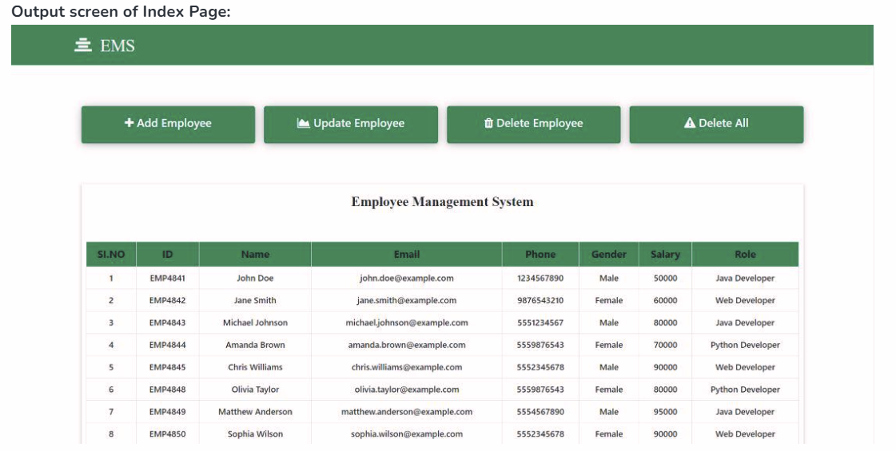
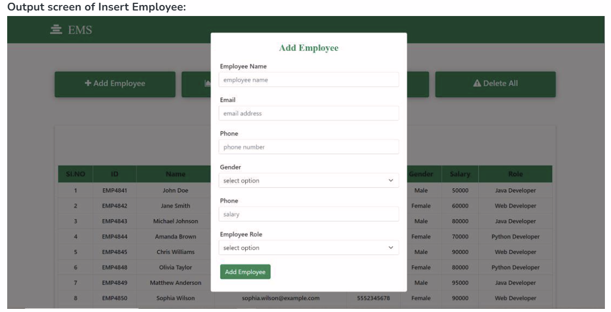
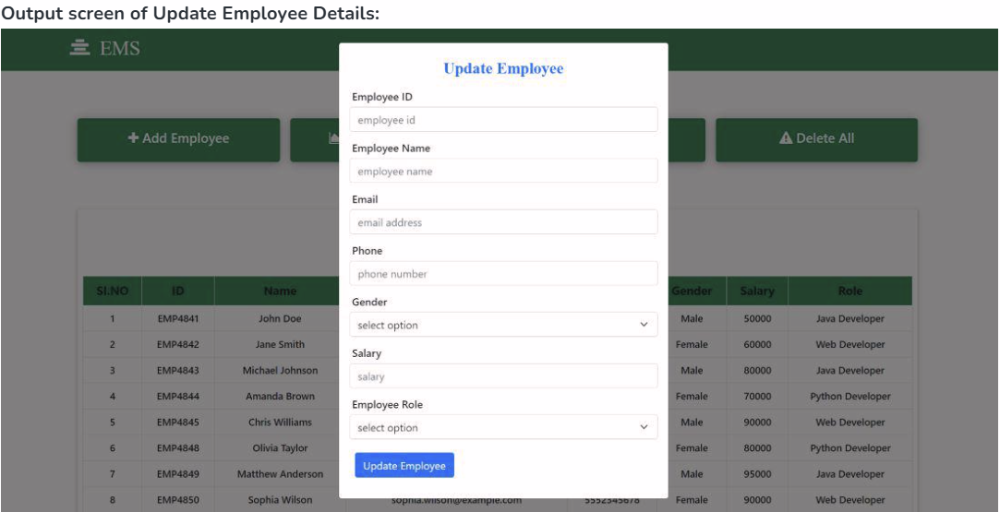
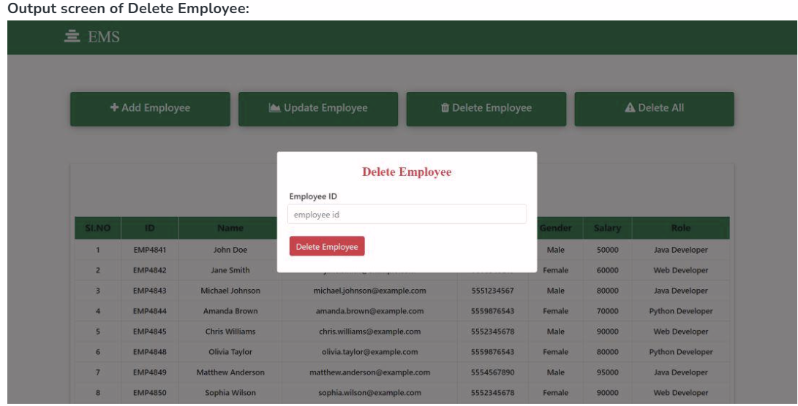
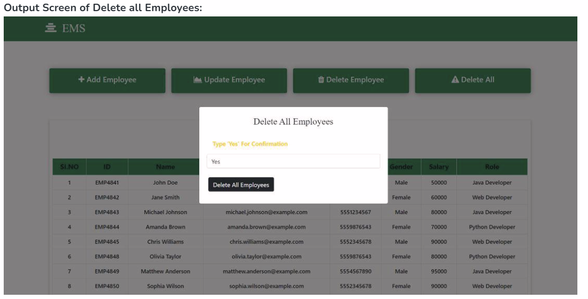

# Employee Management System (EMS) using Spring Boot

This is a **Spring Boot** web application for managing employee data with full **CRUD operations** (Create, Read, Update, Delete). The project uses **MongoDB** for data storage, **Thymeleaf** for dynamic HTML rendering, and **Bootstrap** for responsive UI.

---

## Table of Contents

* [Features](#features)
* [Technologies](#technologies)
* [Project Structure](#project-structure)
* [Setup and Installation](#setup-and-installation)
* [Usage](#usage)
* [Screenshots](#screenshots)
* [License](#license)

---

## Features

* Add new employees with dynamically generated Employee ID
* Update existing employee details
* Delete an employee by ID
* Delete all employees with confirmation
* View all employees in a responsive HTML table

---

## Technologies

* **Java 17+**
* **Spring Boot** (MVC, Data MongoDB)
* **Thymeleaf**
* **MongoDB**
* **Bootstrap 5**
* **Gradle**

---

## Project Structure

```
ems-project/
│
├─ src/main/java/com/ems/app/
│   ├─ controller/       # EmployeeController.java
│   ├─ pojo/             # Employee.java, ConfirmationForm.java
│   └─ repo/             # EmployeeRepo.java
│
├─ src/main/resources/
│   ├─ templates/        # index.html
│   └─ application.properties
│
├─ build.gradle          # Project dependencies
└─ README.md
```

---

## Setup and Installation

1. **Clone the repository:**

```bash
git clone <your-repo-url>
cd ems-project
```

2. **Install dependencies:**

* Gradle will automatically handle dependencies in `build.gradle`:

```gradle
dependencies {
    implementation 'org.springframework.boot:spring-boot-starter-data-mongodb'
    implementation 'org.springframework.boot:spring-boot-starter-thymeleaf'
    implementation 'org.springframework.boot:spring-boot-starter-web'
    compileOnly 'org.projectlombok:lombok'
    developmentOnly 'org.springframework.boot:spring-boot-devtools'
    annotationProcessor 'org.projectlombok:lombok'
    testImplementation 'org.springframework.boot:spring-boot-starter-test'
}
```

3. **Start MongoDB:**

```bash
# macOS (Homebrew)
brew services start mongodb-community
```

4. **Configure database** in `src/main/resources/application.properties`:

```properties
spring.data.mongodb.host=localhost
spring.data.mongodb.port=27017
spring.data.mongodb.database=ems

spring.thymeleaf.prefix=classpath:/templates/
spring.thymeleaf.suffix=.html
```

5. **Run the application:**

* In **Spring Tool Suite (Eclipse)**:
  Right-click `EmsApplication.java` → **Run As → Spring Boot App**
* Default URL: [http://localhost:8080](http://localhost:8080)

---

## Usage

* **Add Employee:** Fill the form and click “Add Employee”. A random ID is generated automatically.
* **Update Employee:** Provide existing Employee ID and update details.
* **Delete Employee:** Provide Employee ID to remove a single record.
* **Delete All Employees:** Type `Yes` in the confirmation field to remove all records.
* All employees are displayed in a responsive table on the homepage.


## Screenshots

**Index Page:**



**Add Employee Modal:**



**Update Employee Modal:**


**Delete Employee Modal:**


**Delete All Employees Modal:**



